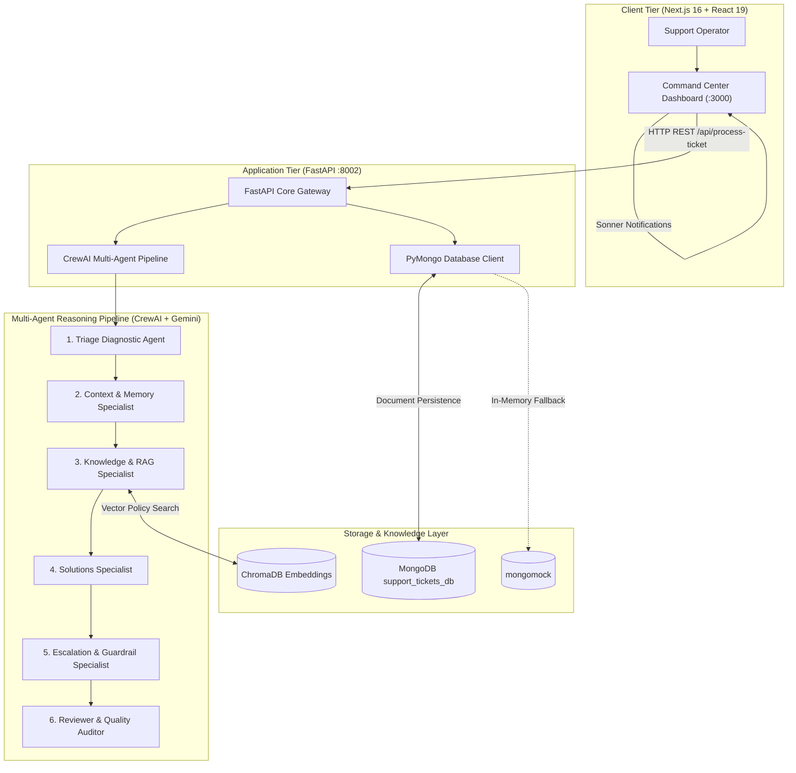

# BrightCone Agentic AI Support System

<div align="center">


**An autonomous multi-agent customer support orchestration and compliance command center powered by CrewAI, Google Gemini, ChromaDB RAG, MongoDB, and Next.js.**

[Features](#-key-features) • [Architecture](#-system-architecture) • [Agent Pipeline](#-multi-agent-execution-pipeline) • [Setup Guide](#-local-setup-instructions) • [API Reference](#-api-reference)

---

</div>

## 📌 Project Overview

**BrightCone** is an enterprise-grade Agentic AI customer support resolution platform that replaces rigid chatbots with an autonomous **6-agent collaborative reasoning pipeline**. Grounded in vector-indexed enterprise policies (**ChromaDB RAG**) and powered by **Google Gemini**, the system autonomously diagnoses inquiries, loads customer session memory, formulates resolutions, strictly enforces financial compliance guardrails, and records structured audit trails directly in **MongoDB**.

Support operations teams interact with a cybernetic, real-time command center built with **Next.js 16**, **React 19**, and **Framer Motion**, featuring live agent stepper feeds, staggered execution history, ChatGPT-style typewriter streaming, animated skeleton loaders, and dynamic risk-based glowing interfaces.

---

## 🏗️ System Architecture



---

## 🤖 Multi-Agent Execution Pipeline

Every customer inquiry passes sequentially through 6 specialized CrewAI agents to ensure thorough diagnosis, strict policy compliance, and deterministic output standards:

```text
[Customer Query]
       │
       ▼
1. 🔍 Triage Diagnostic Specialist
   └── Categorizes issue (Billing, Security, Technical, Account) & assigns priority (Low/Medium/High).
       │
       ▼
2. 👤 Customer Context Specialist
   └── Ingests account tier, SLA terms, VIP privilege status, and contract history.
       │
       ▼
3. 🧠 Knowledge (RAG) Specialist
   └── Executes similarity search against ChromaDB to extract binding enterprise policies.
       │
       ▼
4. ⚙️ Solutions & Action Formulator
   └── Synthesizes step-by-step resolution plan and identifies necessary tool actions.
       │
       ▼
5. 🛡️ Escalation & Compliance Guardrail Specialist
   └── CONDITIONAL AUDIT GATE:
       ├── IF query involves money/refunds/credits:
       │   ├── Action: Blocked -> "Refund API: BLOCKED (HUMAN APPROVAL REQUIRED)"
       │   └── Escalation Status: "Escalated" (Level-2 Human Approval required)
       └── IF query is standard/safe (e.g., password reset, rate limits):
           ├── Action: Approved -> []
           └── Escalation Status: "Resolved"
       │
       ▼
6. 📋 Reviewer & Quality Auditor
   └── Strips formatting noise and guarantees a strictly validated, production-ready JSON schema.
       │
       ▼
[MongoDB Persistence & Real-Time Dashboard UI]
```

---

## ✨ Key Features

### 1. Robust Google Gemini LLM Integration
- Custom `LangChainGeminiLLM` wrapper bypassing LiteLLM endpoint deprecation errors.
- Automatic multi-model fallback rotation pool:
  - `gemini-3.5-flash`
  - `gemini-3.1-flash-lite`
  - `gemini-flash-latest`
  - `gemini-3.5-flash-lite`
  - `gemini-2.5-flash`
- Zero-wait exception handling (`max_retries=0`) preventing hang loops on API quota exhaustions.

### 2. Native PyMongo Document Persistence
- Fully migrated from legacy SQL/SQLite to native **MongoDB** (`mongodb://localhost:27017/support_tickets_db.tickets`).
- Automatic `mongomock` in-memory fallback mechanism ensuring 100% operational resilience even when no local MongoDB daemon is running.
- Document sanitization excluding raw `_id` values to prevent BSON ObjectId serialization issues.

### 3. Strict Conditional Guardrail Enforcement
- **Financial Risk Protection**: Strictly flags refund, reimbursement, or compensation requests with `status: "Escalated"` and records `"Refund API: BLOCKED (HUMAN APPROVAL REQUIRED)"` under `blocked_actions`.
- **Zero False-Positives**: Non-monetary inquiries (e.g., password resets, API documentation requests) are marked `status: "Resolved"` with `blocked_actions: []`.

### 4. Enterprise Command Center Frontend
- **Framer Motion Staggered Agent Trail**: Simulates real-time agent reasoning by sliding and fading each step into place sequentially.
- **ChatGPT-Style Typewriter Effect**: Streams the final customer response character-by-character (12ms/char) with an active blinking cursor and an instant "Skip Typing" action.
- **Real-Time Toast Alerts (`sonner`)**: Instant visual feedback for agent crew dispatches, guardrail escalations, and automated resolutions.
- **Animated Shimmer Skeleton Loader**: Replaces generic spinners with a cybernetic blueprint of the incoming ticket while the CrewAI backend executes.
- **Dedicated Agent Iconography**: Distinct visual identities for all 6 agents utilizing `lucide-react` (`Search`, `UserCheck`, `Brain`, `Cpu`, `ShieldAlert`, `CheckCircle2`).
- **Cyber Glassmorphism & Ambient Glow**: Sleek dark theme (`#090d16`) with dynamic faint red glowing borders for escalated cases and faint cyan glows for resolved tickets.

---

## 📂 Repository Structure

```text
bright-cone-backend/
├── app/
│   ├── main.py                 # FastAPI application routes & CRUD endpoints
│   ├── database.py             # PyMongo client & mongomock resilient fallback
│   ├── auth.py                 # JWT token creation & evaluation auth helpers
│   ├── agents/
│   │   └── ticket_agents.py    # 6-agent CrewAI pipeline & Gemini LLM adapter
│   ├── models/
│   │   └── schemas.py          # Pydantic request & response models
│   ├── services/
│   │   └── rag_service.py      # ChromaDB vector store policy retrieval
│   └── data/
│       └── faq.txt             # Seed corporate policies & FAQs
├── bright-cone-frontend/
│   ├── src/app/
│   │   ├── layout.tsx          # Root layout & dark enterprise theme
│   │   ├── page.tsx            # Main Command Center UI (Framer Motion + Sonner)
│   │   └── globals.css         # Shimmer keyframes, custom cyber scrollbar
│   ├── package.json            # Next.js 16, React 19, Framer Motion, Sonner
│   └── next.config.ts          # Turbopack Next.js configuration
├── requirements.txt            # Python dependencies
├── .env                        # Environment credentials (GEMINI_API_KEY, etc.)
└── README.md                   # System documentation
```

---

## 🚀 Local Setup Instructions

Follow these step-by-step instructions to run the full stack locally on Windows, macOS, or Linux.

### Prerequisites
- **Python 3.10+**
- **Node.js 18+** & **npm**
- **MongoDB** (optional; the backend automatically defaults to an in-memory `mongomock` if no local instance is found)
- **Google Gemini API Key** ([Get a key here](https://aistudio.google.com/))

---

### Step 1: Clone the Repository & Configure Environment

```bash
# Navigate to project root
cd bright-cone-backend

# Create a .env file in the root directory
```

Create or verify `.env` in the root directory:
```env
GEMINI_API_KEY=your_gemini_api_key_here
GOOGLE_API_KEY=your_gemini_api_key_here
MONGODB_URL=mongodb://localhost:27017/
DATABASE_NAME=support_tickets_db
JWT_SECRET_KEY=brightcone_secure_dev_secret_key_2026
```

---

### Step 2: Setup and Start the Python Backend

```bash
# 1. Create and activate a Python virtual environment
# Windows (PowerShell):
python -m venv venv
.\venv\Scripts\Activate.ps1

# macOS / Linux:
python3 -m venv venv
source venv/bin/activate

# 2. Install required Python packages
pip install -r requirements.txt

# 3. Launch the FastAPI server on port 8002
python -m uvicorn app.main:app --host 127.0.0.1 --port 8002 --reload
```

The backend will be available at:
- **API Root**: `http://127.0.0.1:8002/`
- **Health Check**: `http://127.0.0.1:8002/health`
- **Interactive Swagger Docs**: `http://127.0.0.1:8002/docs`

---

### Step 3: Setup and Start the Next.js Frontend

Open a **separate terminal window**:

```bash
# 1. Navigate to the frontend workspace
cd bright-cone-backend/bright-cone-frontend

# 2. Install Node dependencies
npm install

# 3. Start the Next.js development server
npm run dev
```

Open your browser and navigate to:
👉 **`http://localhost:3000`**

---

## 🧪 Demonstration & Evaluation Scenarios

Use the quick preset buttons on the dashboard to test the pipeline:

| Test Scenario | Sample Input Query | Expected Guardrail & Status |
|---|---|---|
| **High-Risk Refund Request** | `"I want an immediate refund for TXN-9988"` | **`Escalated`**<br>Blocked Action: `"Refund API: BLOCKED (HUMAN APPROVAL REQUIRED)"`<br>Pulsing red glow + warning toast alert. |
| **Standard Password Reset** | `"How do I reset my password via registered 2FA email?"` | **`Resolved`**<br>Blocked Actions: `[]`<br>Autonomous password policy synthesized + success toast alert. |
| **Enterprise Rate Limits** | `"What are the rate limits and webhook requirements for Enterprise accounts?"` | **`Resolved`**<br>Blocked Actions: `[]`<br>ChromaDB RAG vectors retrieved for API & webhook throttling policies. |

---

## 📡 API Reference

### 1. Health Check
```http
GET /health
```
**Response (200 OK):**
```json
{
  "status": "healthy",
  "service": "BrightCone Agentic AI Core",
  "agents": 6,
  "database": "MongoDB",
  "environment": "support_tickets_db"
}
```

### 2. Dispatch Agent Workflow
```http
POST /api/process-ticket
Content-Type: application/json

{
  "user_id": "test_enterprise_1",
  "query": "I want an immediate refund for TXN-9988"
}
```
**Response (200 OK):**
```json
{
  "ticket_id": "TCK-89A4B12C",
  "status": "Escalated",
  "details": {
    "issue_category": "Billing & Financial",
    "priority": "High",
    "escalation_status": "Escalated",
    "blocked_actions": [
      "Refund API: BLOCKED (HUMAN APPROVAL REQUIRED)"
    ],
    "agent_execution_history": [
      "Triage Agent: Diagnosed intent as Billing with High priority",
      "Context Agent: Loaded customer account profile and tier",
      "Knowledge Agent: Retrieved corporate refund restrictions from ChromaDB",
      "Resolution Agent: Formulated response and identified refund action",
      "Escalation Agent: Financial guardrail enforced: Direct refund blocked",
      "Reviewer Agent: Validated output schema against production requirements"
    ],
    "final_response": "We have received your request regarding transaction TXN-9988..."
  }
}
```

### 3. List Ingested Tickets
```http
GET /api/tickets?skip=0&limit=50&status=Escalated
```

### 4. Operations Analytics
```http
GET /api/analytics
```
**Response (200 OK):**
```json
{
  "total_tickets": 28,
  "escalated_count": 8,
  "resolved_count": 20,
  "escalation_rate": 28.57
}
```

---

## 🛡️ License & Academic Notice

This project was developed for the **BrightCone Agentic AI** assessment. Designed with clean architectural separation between multi-agent reasoning, strict deterministic guardrails, document database persistence, and a reactive frontend command center.
